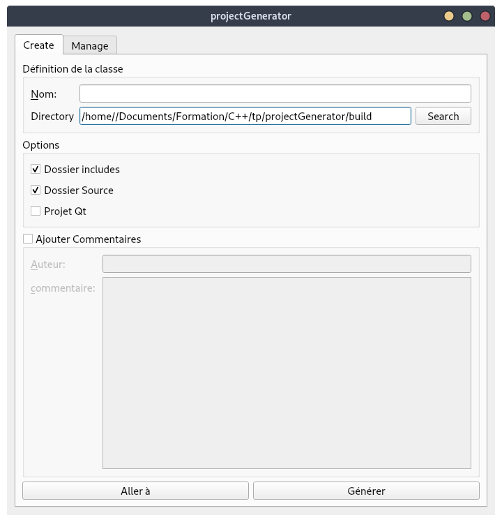
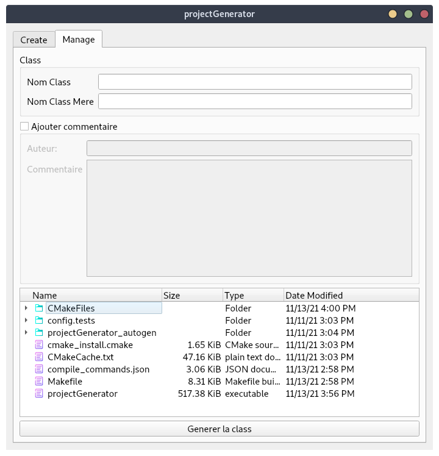

# Projet: Project Generator CPP

## Introduction:

Cet utilitaire permet de créée un projet en c++, avec une structure basic (dossier: includes , src) et un `CMakeLists.txt` afin de pouvoir compiler correctement le projet, on peut aussi choisir l'option Qt qui changera le CMakeLists.txt `(faut changer l'endroit du fichier Qt cmake)`. Il permet aussi de créée des class c++ directement dans le projet,  pour cela il crée le fichier .h et .cpp de la class et les sauvegarde directement dans le dossier includes et src du projet.

## Photos:

## Amélioration:

- Pouvoir ouvrir un fichier depuis l'utilitaire

- Le design

- Ajout de fonctionnalités comme (gestion cmake, test, git)
